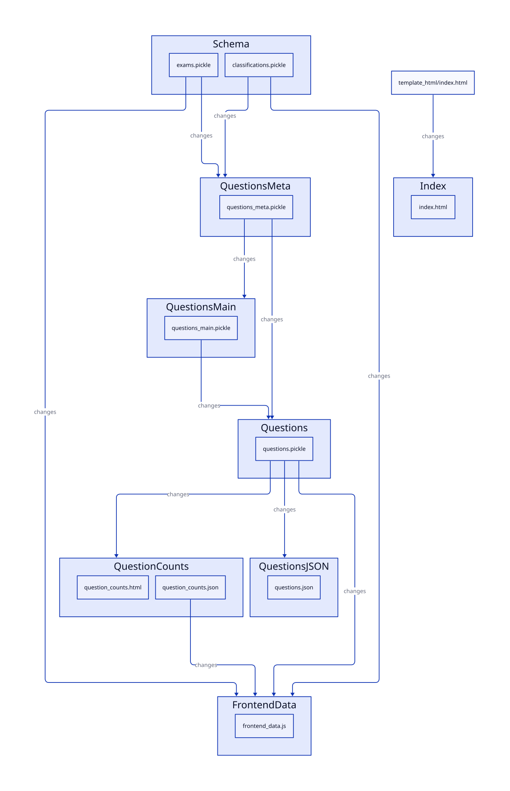

# CLI Usage

## Run entire pipeline to get the current CollegeBoard question set
```bash
$ python3 -m SAT run-stage all --spill-id new
```

## List the available question set versions
```bash
$ python3 -m SAT list-spills
```

## Activate a question set version
```bash
$ python3 -m SAT set-active-spill <spill ID or 'latest'>
```

# Backend Pipeline Diagram


# File Layout
```
.
├── common
│   └── logger.py
├── docs
│   ├── example_responses
│   │   ├── eid_question.json
│   │   ├── ibn_question.json
│   │   ├── lookup.json
│   │   └── questions_meta.json
│   ├── pipeline_diagram.d2
│   ├── pipeline_diagram.svg
│   ├── README.md
│   └── TODO.md
├── oil
│   ├── artifact.py
│   ├── __init__.py
│   ├── pipeline.py
│   ├── spill.py
│   └── util.py
├── SAT
│   ├── explore_database.py
│   ├── __main__.py
│   ├── models.py
│   └── question_bank.py
├── spills
│   ├── 1785107500
│   │   ├── classifications.pickle
│   │   ├── exams.pickle
│   │   ├── frontend_data.js
│   │   ├── index.html
│   │   ├── question_counts.html
│   │   ├── question_counts.json
│   │   ├── questions.json
│   │   ├── questions_main.pickle
│   │   ├── questions_meta.pickle
│   │   └── questions.pickle
│   ├── 1787544833
│   │   ├── classifications.pickle
│   │   ├── exams.pickle
│   │   ├── frontend_data.js
│   │   ├── index.html
│   │   ├── question_counts.html
│   │   ├── question_counts.json
│   │   ├── questions.json
│   │   ├── questions_main.pickle
│   │   ├── questions_meta.pickle
│   │   └── questions.pickle
│   └── active -> 1787544833
├── static
│   ├── script
│   │   ├── control_panel.js
│   │   ├── filters.js
│   │   ├── helpers.js
│   │   ├── index.js
│   │   ├── migrate.js
│   │   ├── options.js
│   │   ├── progress.js
│   │   ├── question.js
│   │   ├── question_viewer.js
│   │   ├── storage.js
│   │   ├── toggle_button.js
│   │   ├── users.js
│   │   └── versions.js
│   └── style
│       ├── main.css
│       └── question-counts.css
├── template_html
│   ├── base.html
│   └── index.html
├── .gitignore
├── index.html -> spills/active/index.html
├── requirements.txt
└── update_docs.sh

14 directories, 59 files
```
